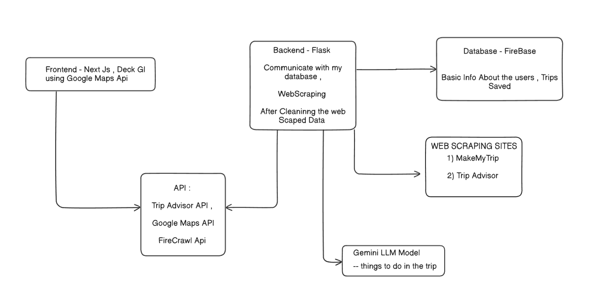

 # 🏖 AI Trip Planner  

## 📌 Overview  
Trippy is an intelligent travel planning application that generates personalized trip itineraries based on user preferences. By inputting details such as source, destination, number of days, budget, and preferred places of interest (e.g., historical sites, kid-friendly locations), users receive a well-structured travel plan tailored to their needs.  

Leveraging AI and machine learning, the planner optimizes the itinerary by considering factors like distance, travel time, and budget constraints. It ensures an efficient and enjoyable trip by providing recommendations for attractions, accommodations, dining options, and shopping recommendations.  

This project aims to simplify trip planning by automating the process and delivering a hassle-free experience for travelers.  

---
## 🏗 Architecture For Trippy

1. *User Input:*  
   - The user fills out a form with trip details such as source, destination, number of days, budget, and places of interest.  

2. *Filtering Places using Google Maps API:*  
   - Based on the user's preferred categories (historical sites, kid-friendly places, etc.), we fetch and filter the *top 20 places* from Google Maps API.  
   - The API also provides *opening and closing times* for each location.  

3. *Data Collection via Web Scraping:*  
   - We use *BeautifulSoup* to scrape additional travel data, including:  
     - Available *modes of transport*.  
     - *Best food to try* at the destination.  
     - *Best items to purchase*.  
     - *Ideal times to visit each attraction*.  

4. *AI Model Processing:*  
   - The collected data is *fine-tuned* and processed by the *Gemini AI model*.  
   - The AI generates a *structured trip plan* with:  
     - Optimized *day-wise itinerary*.  
     - Recommended *places to visit per day*.  
     - *Travel routes displayed on an interactive map*.  

5. *User Customization & Drag-and-Drop Planning:*  
   - The *places list* is displayed in a *bucket-style UI*.  
   - Users can *drag and drop* places into each day's itinerary and save their plan.  
   - Alternatively, they can use *AI automation* to generate a fully optimized schedule.  

6. *Final Output:*  
   - The finalized trip plan includes:  
     - *Map-based route visualization*.  
     - *Daily travel plan* with suggested times.  
     - *Customizable itinerary* that users can modify as needed.  

This architecture ensures an AI-powered, interactive, and customizable trip planning experience. 🚀  

---
## 🚀 Features  

-  Users can generate an AI-powered trip plan based on their inputs like source, destination, number of days, budget, and preferred interests.

- Users can view travel options between their source place and destination place.

-  Users can view a day-wise itinerary with optimized scheduling of the best places to visit each day (automated).

-  Users can find the best hotels recommended based on their budget and preferred location.

-  Users can discover local cuisines with must-try food suggestions tailored to their destination.

-  Users can explore a shopping guide that lists the best items to purchase from the destination.

-  Users can check the best time to visit each attraction to plan their trip more efficiently.

-  Users can view an interactive travel route map that displays daily travel routes for seamless navigation.

-  Users can customize their itinerary by editing and modifying the AI-generated plan as per their preference.

-  Users can post reviews and suggestions on a dedicated page to share their experiences about visited places.

-  Users can interact with an AI chatbot for instant travel-related assistance and recommendations.

## 📷 Screenshots  

### Home Page

### Trip Planning Form

- Give necessary details for the trip 
### Planning Page

- The left section is for viewing the details of place you click it from user reviews, car parking to Awards you can view in there.

- Users can Darg and Drop those places into the buckets on the right from the map section in the middle If you are too lazy Just ask ai to do it for you by clicking the Ai Automate button customization still possible.

### Path Finder And travel Recommendations

- Users can also choose to optimize the path between the places by using the path finder which give you the travel plan for the day.
- Travel recommendations which scraped from various sources are used to generate the options to travel for you 

---

## 🛠 Tech Stack  

### *Frontend:*  
- [Next.js](https://nextjs.org/) – React-based framework for server-side rendering and frontend development.  
- [React](https://react.dev/) – Used for building the user interface.  
- [React DnD Toolkit](https://react-dnd.github.io/react-dnd/about) – Enables drag-and-drop functionality for better interactivity.  

### *Backend:*  
- [Flask](https://flask.palletsprojects.com/) – Lightweight Python framework for building the backend API.  

### *Database & Storage:*  
- [Firebase](https://firebase.google.com/) – Used for user authentication, real-time database, and storage.  

### *AI & APIs:*  
- [Gemini API](https://ai.google.dev/) – AI-powered text and chatbot capabilities.  
- [Google Search Engine](https://programmablesearchengine.google.com/) – Used for fetching relevant travel data and suggestions.  

### *Mapping & Navigation:*  
- [Google Maps API](https://developers.google.com/maps) – Displays interactive travel routes and locations.  

### *Web Scraping:*  
- [BeautifulSoup](https://www.crummy.com/software/BeautifulSoup/) – Extracts travel-related data from various sources.  

---